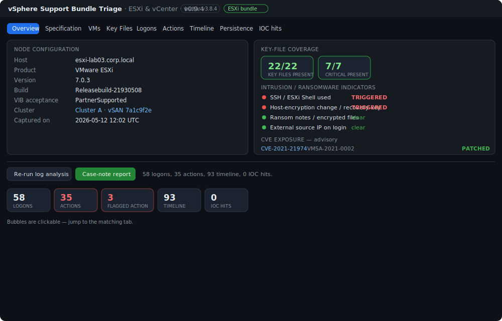
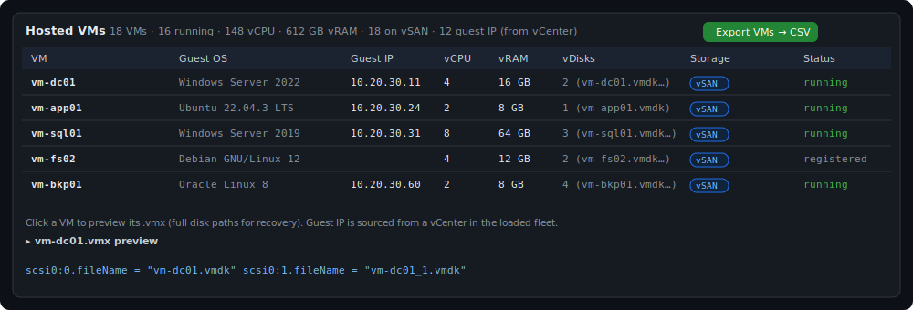
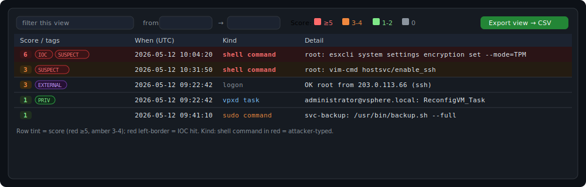
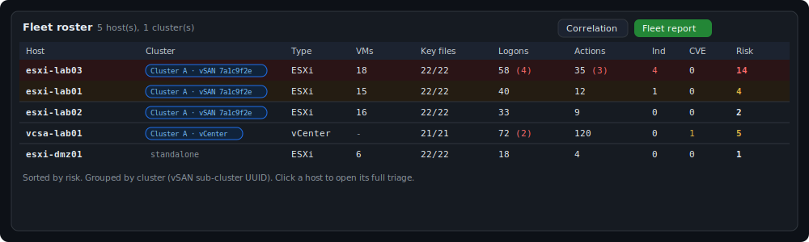
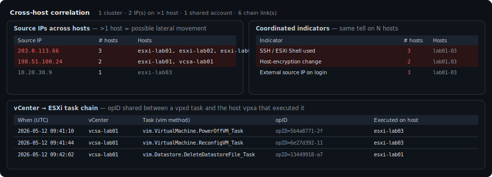

# vSphere Support Bundle Triage Tool

A single-file Windows **HTA** for rapid DFIR triage of VMware **ESXi** (`vm-support`) and **vCenter / VCSA** (`vc-support`) log bundles. It answers two questions fast: **what is this node** (configuration, VMs, storage) and **what happened on it** (logins, actions, persistence, ransomware / intrusion indicators) — for one host or a whole cluster.

No install, no runtime, no dependencies beyond what Windows ships. It reads the bundle **read-only**, never runs `vm-support`/`vc-support`, and never contacts the source host.

> **Auto-detects** ESXi vs vCenter and adapts the tab set. Point it at a single bundle, or at a **folder of bundles** for fleet-wide triage with cross-host correlation and the vCenter&rarr;ESXi task chain.

## Screenshots

_Illustrative UI renders with synthetic placeholder data (lab hostnames, TEST-NET IPs)._

**Overview** — node summary, key-file coverage, ransomware indicators, CVE panel, clickable stat bubbles

**VMs** — per-VM inventory with guest IP and click-to-preview `.vmx`

**Timeline** — colour-coded Score/tags and Kind, with the multiselect score filter

**Fleet roster** — hosts grouped by vSAN cluster, worst-first

**Correlation** — shared IPs, coordinated indicators, and the vCenter&rarr;ESXi task chain

## Features

- **Overview** — node summary, key-file coverage, an ESXi **ransomware / intrusion indicator** panel, and a **CVE-exposure** panel (links to NVD + the VMSA).
- **Specification** — deep config: identity, networking (VMkernel adapters, physical NICs, DNS/NTP), **datastores + vSAN & physical-disk layout** (for vDisk recovery scoping), security posture (AD join, VIB acceptance, syslog), and for vCenter the SSO identity sources / AD integration and **managed ESXi hosts**.
- **VMs** (ESXi) — every registered VM from its `.vmx`: guest OS, vCPU, vRAM, vDisks, datastore/vSAN, running status; click to preview the `.vmx` disk paths. Guest IP is enriched from a vCenter in the fleet.
- **Key Files** — a curated inventory of high-value artifacts (presence, size, open folder/file); an absent critical artifact is itself a finding.
- **Logons / Actions / Timeline** — parsed, scored, colour-coded events (ESXi `shell.log`/`auth.log`/`hostd`; vCenter `websso`/`vpxd`/`auth.log`) with a multiselect score filter, case-window, and **actor / kind dropdown filters**. vCenter tasks are attributed to a user (nearest human SAML login).
- **Login sessions (paired)** — one row per API session: login &rarr; logout paired by session ID (vCenter `vpxd` SessionManager GUIDs; ESXi `hostd` session events), with duration, user (from the SAML token), source IP (time-joined from the envoy access log when unambiguous), and client/user-agent. Noise filters for loopback (on by default) and brief automated sessions; unpaired rows are kept and labelled (active at capture / pre-window / failed login).
- **Persistence & tampering** — boot scripts, remote-syslog state, DCUI ransom-note check, VIB acceptance, log-integrity, `ld.so.preload`, cron/systemd.
- **IOC hits** — sweeps an `IOC.txt` (one term per line, next to the app) across the key logs.
- **Fleet mode** — discover every bundle under a folder, roster them by risk, group by **vSAN cluster**, and run **cross-host correlation**: shared source IPs (lateral movement), shared accounts, shared IOCs, coordinated indicators, a merged timeline, and the **vCenter&rarr;ESXi opID task chain**. Re-runs **reuse each host's saved analysis** from `_Processed` when the source bundle is unchanged (uncheck *reuse cached* to force a fresh pass); the roster's **Analyzed** column shows when each host was last processed.
- **Reports & exports** — per-view CSVs, a standalone node **Specification HTML**, a per-host **Case-note report**, and a consolidated **Fleet report**.

See the [Field Manual](vSphere-Bundle-Triage-Manual.html) for full documentation.

## Requirements

- Windows 10 / 11 (ships `bsdtar` as `C:\Windows\System32\tar.exe`).
- Run the `.hta` from a **local** path (network locations trigger Windows zone restrictions on the UTF-8 reader).
- `zstd.exe` is only needed for vCenter `.zst` logs — the tool probes `tools\` and PATH and offers to fetch the official [facebook/zstd](https://github.com/facebook/zstd) build if missing.

## Quick start

1. Download `vSphere-Bundle-Triage.hta` from the [latest release](../../releases/latest) into a local working folder and double-click it.
2. **Bundle** — point at the nested archive that holds the tree (ESXi `<host>.tar` / vCenter `<host>.tgz`), the outer `.tgz`, or an already-extracted folder. For fleet mode, point at a **parent folder** of bundles.
3. **Target hostname** (required) — names the output folder `_Processed\<host>\vSphere\`.
4. Click **Analyze bundle** (single) or **Triage fleet folder…** (folder). Log analysis runs automatically.

Command line: `mshta.exe "vSphere-Bundle-Triage.hta" "<archiveOrFolder>" ["<outDir>"] [/auto] [/from:yyyy-MM-dd] [/to:yyyy-MM-dd]`

## Notes & caveats

- **CVE verdicts are advisory** — confirm against the linked VMSA (vCenter exposes only a build number and 7.0/8.0 build ranges overlap, so the tool is deliberately conservative).
- **Support bundles are targeted**, not disk images — artifacts the bundle doesn't capture are shown as "not captured", not "clean".
- **Guest IPs** come from a vCenter in the same fleet (ESXi bundles don't carry them).
- **vCenter task&rarr;user attribution** is approximate (nearest human login) — corroborate with the Logons tab.
- The tool updates itself: the **Update** button appears when a newer release is published, and **Instructions** fetches the latest Field Manual.

## Part of the DFIR wrapper family

A sibling of the Zimmerman-tool and UAC HTA wrappers, and the [DFIR Windows Artifact Finder](https://github.com/bpmorris22/DFIR-Windows-Artifact-Finder).

## License

MIT — see [LICENSE](LICENSE).
