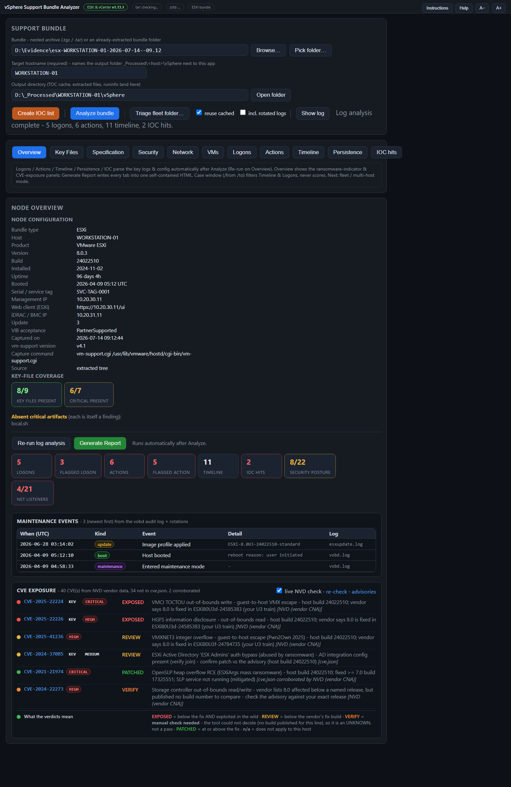
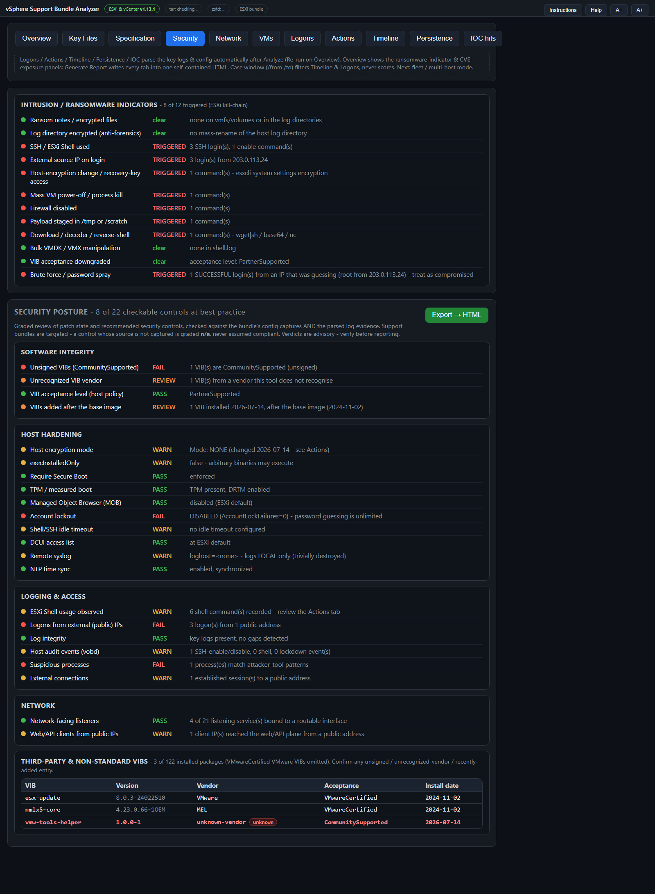
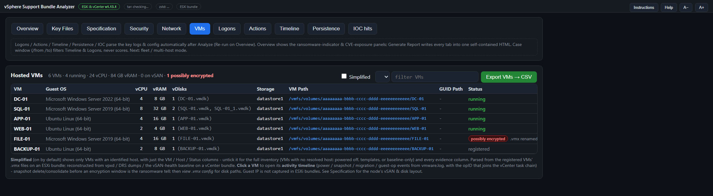
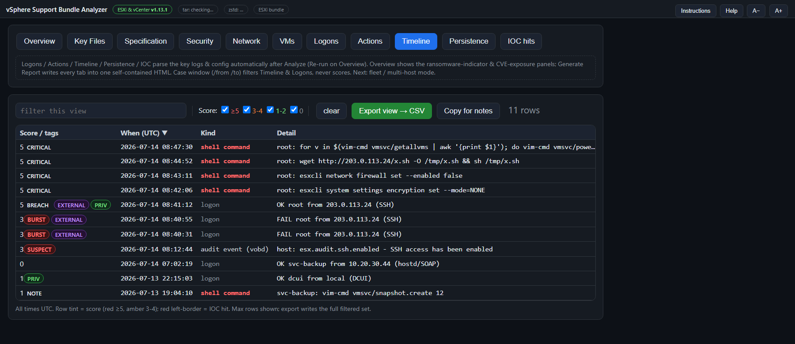
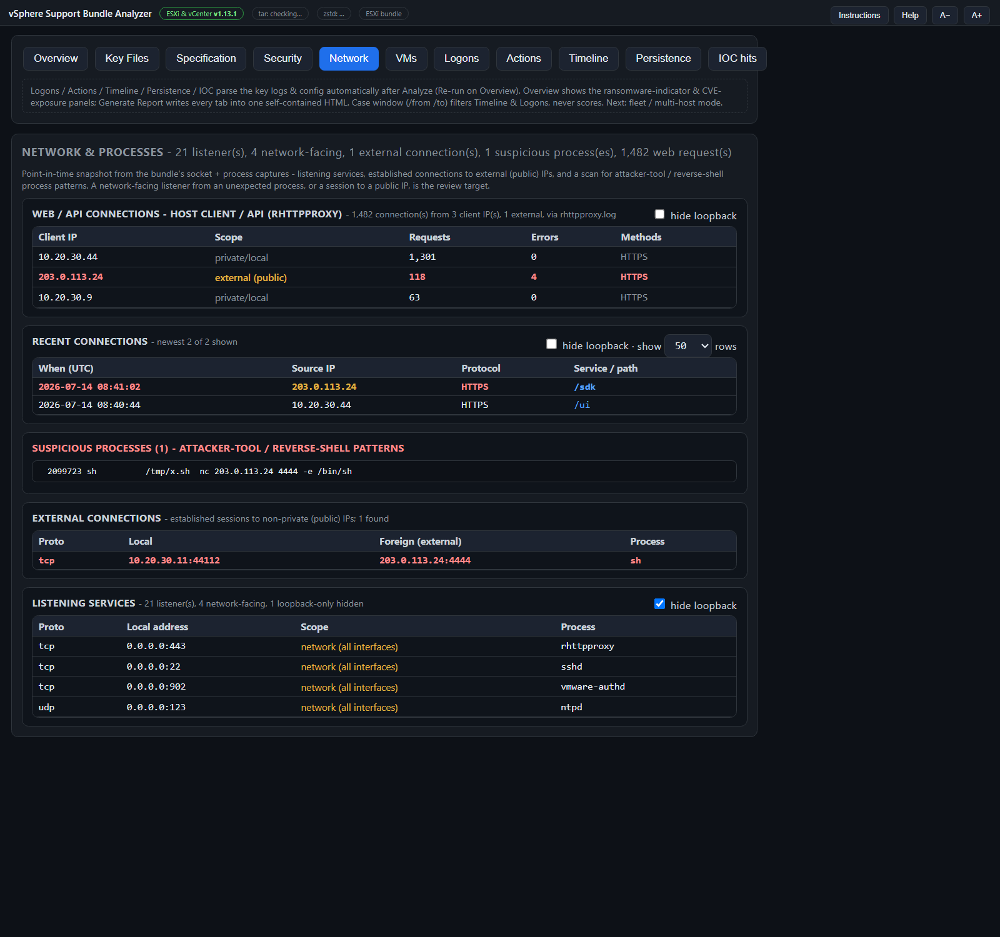

# vSphere Support Bundle Analyzer

A single-file Windows **HTA** for rapid DFIR triage of VMware **ESXi** (`vm-support`) and **vCenter / VCSA** (`vc-support`) log bundles. It answers two questions fast: **what is this node** (configuration, VMs, storage) and **what happened on it** (logins, actions, persistence, ransomware / intrusion indicators) - for one host or a whole cluster.

No install, no runtime, no dependencies beyond what Windows ships. It reads the bundle **read-only**, never runs `vm-support`/`vc-support`, and never contacts the source host.

> **Auto-detects** ESXi vs vCenter and adapts the tab set. Point it at a single bundle, or at a **folder of bundles** for fleet-wide triage with cross-host correlation and the vCenter&rarr;ESXi task chain.

## Screenshots

Real screen captures of the tool, rendered from its own UI with **synthetic demo data** (placeholder host, TEST-NET-3 addresses). Shown at the app's 130% zoom (the A+ control).

**Overview** - node configuration, key-file coverage, maintenance events and the live CVE panel (vendor data via NVD)

**Security** - intrusion / ransomware indicators above the graded posture matrix

**VMs** - inventory with VM Path (the folder holding the .vmx / .vmdk) and encrypted-VM detection

**Timeline** - logons and actions merged, time-ordered and scored

**Network** - listeners, external connections, suspicious processes and the web/API client summary

## Features

- **Overview** - node summary (product, build, **install date**, **uptime + derived boot time**), key-file coverage, a **Maintenance events** table (boots, reboot/shutdown *with the recorded reason*, maintenance-mode enter/exit, VIB/image installs), and a **CVE-exposure** panel (per-CVE links to NVD, plus the Broadcom advisory index; fix builds come from the editable `cve.json`). Derived values (install / uptime / booted) name their source on hover - they are computed, not fields the platform records.
- **Security** - opens with the **ransomware / intrusion indicator** panel, then a graded posture review: VIB integrity (unsigned / CommunitySupported / added after the base image), acceptance level, host encryption mode, Secure Boot / TPM, MOB, lockout + password policy, DCUI access list.
- **Specification** - deep config: identity, networking (VMkernel adapters, physical NICs, DNS/NTP), **datastores + vSAN & physical-disk layout** (for vDisk recovery scoping), security posture (AD join, VIB acceptance, syslog), and for vCenter the SSO identity sources / AD integration and **managed ESXi hosts**.
- **VMs** - the hosted VM inventory, **including when the VMs are ransomware-encrypted**:
  - *ESXi* - every registered VM from its `.vmx`: guest OS, vCPU, vRAM, vDisks, datastore/vSAN, running status; click to preview the `.vmx`. A VM whose `.vmx` is **missing or ransom-renamed** (`web.vmx.locked`, `disk.vmdk.8base`) is **still listed and tagged "possibly encrypted"**, with its name recovered from `vmInventory.xml`, a sibling `.vmdk`, or the folder.
  - *vCenter* - a `vc-support` bundle contains **no `.vmx` at all**, so the list is **reconstructed from logs**: names + MoRefs from `vpxd`, powered-on placement, vCPU and vRAM from the **DRS dumps**, and a historical baseline recovered from the vSAN cloud-health data. VMs restored from backup, re-registered under a new MoRef, or present in the baseline but gone from current logs are flagged for review.
  - **vSAN GUID Path** (`/vmfs/volumes/vsan:<datastore-uuid>/<vm-uuid>`) - the recovery handle that survives a `.vmx` rename - plus **VMDK disk extents** (start/end sector + vSAN object backing) where the descriptor was captured.
  - **Simplified** view (default) shows just the VMs with an identified host; untick it for the full evidence columns. CSV exports exactly what the view shows.
  - **Virtual Machine events** - create / delete / modify / start / stop / reboot / snapshot / migrate, per VM, with who asked and which client it came from, a multiselect type filter and CSV export. ESXi reads hostd's task stream; vCenter reads the vpxd task stream.
- **Key Files** - a curated inventory of high-value artifacts (presence, size, open folder/file); an absent critical artifact is itself a finding.
- **Logons / Actions / Timeline** - parsed, scored, colour-coded events (ESXi `shell.log`/`auth.log`/`hostd`; vCenter `websso`/`vpxd`/`auth.log`) with a multiselect score filter, case-window, and **actor / kind dropdown filters**. vCenter tasks are attributed to a user (nearest human SAML login).
  - **Tiered command scoring** - a ransom-style `.vmx`/`.vmdk` rename, a reverse shell, a mass power-off loop or `--mode=none` on host encryption score **5 (CRITICAL)**; SSH-enable, firewall-off, a single power-off or a `/etc/shadow` read score **3**; registration and lock-file tampering **2**; VM enumeration **1**. Read-only diagnostics (e.g. `vmkfstools -D`) deliberately score **0**.
  - **Brute force / password spray** detection keyed on **shape, not volume**: repeated failures for one user+IP in a short window (BURST), one IP against many users (SPRAY), and - the one that matters - a guessing IP that then **succeeds** (BREACH). A raw failure count over a years-long `websso.log` is meaningless and fires on every healthy vCenter, so when it is clear it explains *why*.
- **Login sessions (paired)** - one row per API session: login &rarr; logout paired by session ID (vCenter `vpxd` SessionManager GUIDs; ESXi `hostd` session events), with duration, user (from the SAML token), source IP (time-joined from the envoy access log when unambiguous), and client/user-agent. Noise filters for loopback (on by default), brief automated sessions, and unpaired rows; unpaired rows are kept by default and labelled (active at capture / pre-window / failed login).
- **Persistence & tampering** - boot scripts, remote-syslog state, DCUI ransom-note check, VIB acceptance, log-integrity, `ld.so.preload`, cron/systemd.
- **IOC hits** - sweeps an `IOC.txt` (one term per line, next to the app) across the key logs.
- **Fleet mode** - discover every bundle under a folder, roster them by risk, group by **vSAN cluster**, and run **cross-host correlation**: shared source IPs (lateral movement), shared accounts, shared IOCs, coordinated indicators, a merged timeline, and the **vCenter&rarr;ESXi opID task chain**. Re-runs **reuse each host's saved analysis** from `_Processed` when the source bundle is unchanged (uncheck *reuse cached* to force a fresh pass); the roster's **Analyzed** column shows when each host was last processed.
- **Reports & exports** - per-view CSVs, a standalone node **Specification HTML**, a per-host **report** (the green **Generate Report** button - every tab in one self-contained HTML, with a clickable navigation pane), and a consolidated **Fleet report**.

See the [Field Manual](vSphere-SupportBundle-Analyzer-Manual.html) for full documentation.

## Requirements

- Windows 10 / 11 (ships `bsdtar` as `C:\Windows\System32\tar.exe`).
- Run the `.hta` from a **local** path (network locations trigger Windows zone restrictions on the UTF-8 reader).
- `zstd.exe` is only needed for vCenter `.zst` logs - the tool probes `tools\` and PATH and offers to fetch the official [facebook/zstd](https://github.com/facebook/zstd) build if missing.

## Quick start

1. Download `vSphere-SupportBundle-Analyzer.hta` from the [latest release](../../releases/latest) into a local working folder and double-click it.
2. **Bundle** - point at the nested archive that holds the tree (ESXi `<host>.tar` / vCenter `<host>.tgz`), the outer `.tgz`, or an already-extracted folder. For fleet mode, point at a **parent folder** of bundles.
3. **Target hostname** (required) - names the output folder `_Processed\<host>\vSphere\`.
4. Click **Analyze bundle** (single) or **Triage fleet folder…** (folder). Log analysis runs automatically.

Command line: `mshta.exe "vSphere-SupportBundle-Analyzer.hta" "<archiveOrFolder>" ["<outDir>"] [/auto] [/from:yyyy-MM-dd] [/to:yyyy-MM-dd]`

## Notes & caveats

- **CVE exposure is checked LIVE against NVD** (on by default, one request per bundle, toggleable and persisted). Broadcom is the CNA for VMware CVEs and files structured version data that NVD republishes free - including the fixed build per release line - so verdicts come from the vendor's own data, with the CISA **KEV** flag, CVSS severity, and the real advisory link. Known-exploited sort to the top, and **every row states its source**.
- **`cve.json` fills the gaps (hybrid).** NVD carries no structured fix for older advisories, sometimes only one release line, and often only update *labels* for vCenter - those rows come from `cve.json` (data, not code; edit it, then stamp `reviewed` / `reviewedBy`). Where the two disagree on a build, **the vendor wins and the row says so** - that means `cve.json` needs correcting.
- **Offline / air-gapped?** Untick the live check, or let it fail: the tool uses `cve.json` only **and says so** ("absence here is not evidence of absence"). A failed or disabled check is never rendered as a clean result, and a missing/invalid `cve.json` shows **NOT ASSESSED** rather than an empty section.
- **Support bundles are targeted**, not disk images - artifacts the bundle doesn't capture are shown as "not captured", not "clean".
- **Guest IPs** come from a vCenter in the same fleet (ESXi bundles don't carry them).
- **vCenter task&rarr;user attribution** is approximate (nearest human login) - corroborate with the Logons tab.
- The tool updates itself: the **Update** button appears when a newer release is published, and **Instructions** fetches the latest Field Manual.

## Part of the DFIR wrapper family

A sibling of the Zimmerman-tool and UAC HTA wrappers, and the [DFIR Windows Artifact Finder](https://github.com/bpmorris22/DFIR-Windows-Artifact-Finder).

## License

MIT - see [LICENSE](LICENSE).
